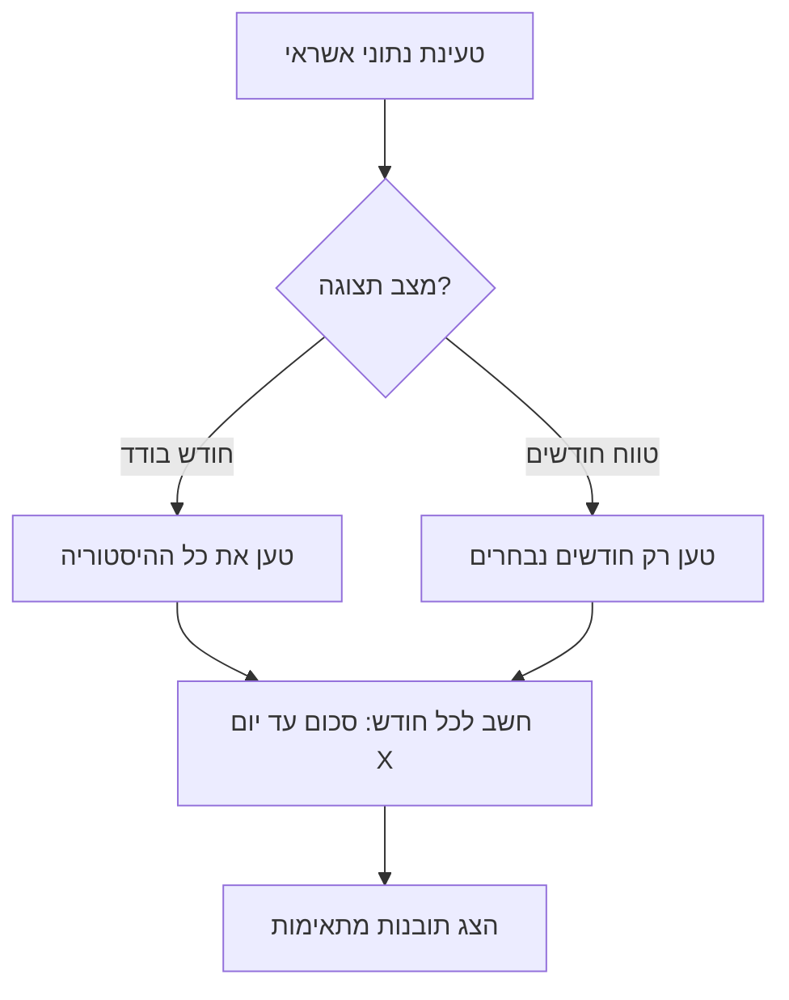

# תיקון תובנות אשראי - חישוב נכון לפי יום בחודש

## מה יתוקן

### הלוגיקה הנוכחית שגויה
כרגע התובנות לא מחשבות נכון לפי תאריך העסקה, ולא מתחשבות בטווח הנבחר.

### התצוגה החדשה

**במצב חודש בודד (ניווט רגיל):**
| ריבוע | תוכן |
|-------|------|
| חודש שעבר | סכום אשראי עד יום X (לפי תאריך עסקה) |
| ממוצע | ממוצע עד יום X מכל החודשים במאגר |
| הגבוה ביותר | החודש עם הכי הרבה אשראי עד יום X |
| הנמוך ביותר | החודש עם הכי פחות אשראי עד יום X |

**במצב טווח חודשים:**
| ריבוע | תוכן |
|-------|------|
| ממוצע | ממוצע עד יום X **מהחודשים שנבחרו בלבד** |
| הגבוה ביותר | החודש הגבוה **מתוך הנבחרים** עד יום X |
| הנמוך ביותר | החודש הנמוך **מתוך הנבחרים** עד יום X |

*(בטווח - אין "חודש שעבר" כי זה לא רלוונטי)*

### תיקון הבאג של "0 ש"ח"
הבעיה: החישוב הנוכחי לא בודק נכון את תאריך העסקה (`date`) מול היום בחודש.
הפתרון: לבדוק את היום מתוך שדה `date` בפורמט נכון.

### זרימת החישוב

### מה יוסר
- ריבוע "החודש הנוכחי" (מיותר - כבר מוצג במקומות אחרים)

### מה ישאר/ישתנה
- הכותרת תציג "תובנות אשראי (עד יום X בחודש)"
- 4 ריבועים במצב רגיל, 3 ריבועים במצב טווח