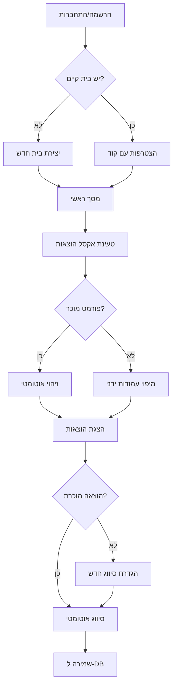

# אפליקציית ניהול הוצאות והכנסות - גרסה ראשונה

## סקירה כללית

אפליקציה לניהול תקציב משפחתי עם התחברות, שיתוף נתונים בין בני הבית, ייבוא אקסל מחברות אשראי, וסיווג חכם של הוצאות.

---

## מה ייבנה בגרסה הראשונה

### 1. מערכת חשבונות ובית משותף
- הרשמה והתחברות
- יצירת "בית" משותף עם קוד הזמנה
- כל בני הבית רואים ומנהלים את אותם נתונים

### 2. ייבוא קבצי אקסל
- זיהוי אוטומטי של פורמט **ישראכרט** ו**כאל**
- מצב גמיש עם מיפוי עמודות ידני לפורמטים אחרים
- זיהוי אוטומטי של שם הוצאה, סכום ותאריך

### 3. סיווג הוצאות לפי 6 קריטריונים
כל הוצאה מסווגת לפי:
| קריטריון | דוגמאות |
|----------|---------|
| קטגוריה | מזון, תחבורה, בילויים, חשבונות... |
| תדירות | חד פעמי, חודשי, שנתי |
| סכום | קבוע / משתנה |
| סוג הוצאה | חובה / אפשר לקצץ / מותרות |
| אמצעי תשלום | אשראי / מזומן / העברה |
| כרטיס אשראי | 4 ספרות אחרונות |

### 4. לימוד אוטומטי של הוצאות
- בפעם הראשונה שמופיעה הוצאה חדשה - מגדירים את הסיווג שלה
- מהפעם השנייה והלאה - הסיווג מוחל אוטומטית
- הגדרת ברירת מחדל להוצאות לא מוכרות

### 5. ייבוא מאסטר של הוצאות מוכרות
- טעינת קובץ אקסל עם שמות הוצאות וסיווגן מראש
- חוסך הגדרה ידנית של הוצאות שכיחות

### 6. מסך הגדרות מלא
- עריכת קטגוריות (הוספה/מחיקה/שינוי שם)
- עריכת כל סוגי הסיווג
- הגדרת ברירת מחדל להוצאות חדשות
- ניהול כרטיסי אשראי

---

## זרימת המשתמש

---

## מסכים עיקריים

### מסך ראשי
- סיכום מהיר של החודש הנוכחי
- כפתורי גישה מהירה: טעינת אקסל, הגדרות, רשימת הוצאות

### מסך ייבוא אקסל
- גרירת קובץ או בחירה
- תצוגה מקדימה של הנתונים
- זיהוי פורמט עם אפשרות לתיקון ידני

### מסך הגדרת הוצאה חדשה
- בחירת כל 6 הקריטריונים
- אפשרות "זכור להבא"

### מסך הגדרות
- ניהול קטגוריות
- ניהול סוגי סיווג
- הגדרת ברירת מחדל
- ניהול כרטיסי אשראי
- ניהול בית (הזמנת חברים, יציאה)

### רשימת הוצאות
- תצוגת טבלה עם כל ההוצאות
- מיון לפי תאריך/סכום/קטגוריה
- עריכה וסיווג מחדש

---

## מה נדחה לשלבים הבאים

| תכונה | שלב |
|-------|-----|
| דשבורד מלא עם גרפים וויזואליזציות | שלב 2 |
| פילטרים מתקדמים וטווחי תאריכים | שלב 2 |
| ניהול הכנסות | שלב 2 |
| תקציב ומזומן חודשי | שלב 3 |
| תקציב יומי שנשאר | שלב 3 |
| הערות וחריגים | שלב 3 |
| API לחברות אשראי | לא ניתן (דורש אינטגרציות חיצוניות) |

---

## עיצוב ומראה

- ממשק בעברית מלא (RTL)
- צבעוניות נקייה עם הדגשות לסוגי הוצאות
- מותאם למובייל ודסקטופ
- חוויה נוחה לייבוא וסיווג מהיר

---

## הערות טכניות

- הנתונים נשמרים בענן עם אבטחה מלאה
- כל משתמש רואה רק את נתוני הבית שלו
- ייבוא האקסל מתבצע בדפדפן - הקבצים לא נשלחים לשרת