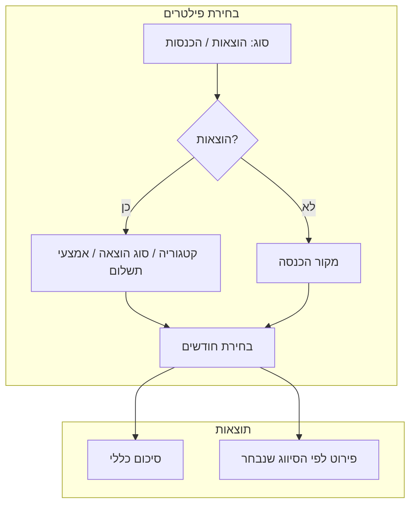

# שיפורי מסך בית + עמוד חישובים מתקדמים (מעודכן)

## חלק א׳: שיפורי מסך הבית

### 1. בורר טווח חודשים
- לחצן חדש ליד בורר החודש הנוכחי: "בחר טווח"
- בלחיצה נפתח חלון לבחירת:
  - חודש התחלה וחודש סיום
  - או בחירה מהירה: "3 חודשים אחרונים", "6 חודשים", "שנה"

### 2. ריבועי סיכום מורחבים (כשנבחר טווח)
כשנבחר יותר מחודש אחד, הריבועים יציגו:

| ריבוע | תצוגה |
|-------|--------|
| הוצאות | סה"כ + ממוצע חודשי + החודש הגבוה + החודש הנמוך |
| הכנסות | סה"כ + ממוצע חודשי + החודש הגבוה + החודש הנמוך |
| מאזן | סה"כ + ממוצע חודשי |

### 3. תובנות אשראי מחודשים קודמים (סקשן חדש)
ריבוע נפרד שמציג נתונים על **חיובי אשראי בלבד**:
- **ממוצע אשראי עד היום בחודש** — משווה את סך חיובי האשראי עד ליום X בחודש הנוכחי לעומת הממוצע באותו יום בחודשים קודמים
- **החודש הגבוה ביותר** — איזה חודש היה עם הכי הרבה הוצאות אשראי
- **החודש הנמוך ביותר** — איזה חודש היה עם הכי פחות הוצאות אשראי
- אינדיקציה ויזואלית (חץ למעלה/למטה) אם החודש הנוכחי גבוה או נמוך מהממוצע

---

## חלק ב׳: עמוד חישובים מתקדמים

### מבנה העמוד

### פאנל סינון

**בחירת סוג נתונים:**
- הוצאות / הכנסות

**סינון הוצאות (3 אפשרויות, ניתן לבחור אחת או יותר):**
- לפי קטגוריה — רשימה עם צ׳קבוקסים
- לפי סוג הוצאה — קבוע/משתנה/חובה/אופציונלי
- לפי אמצעי תשלום — מזומן/אשראי/העברה וכו׳

**סינון הכנסות:**
- לפי מקור הכנסה — משכורת/פרילנס/השכרה וכו׳

**בחירת חודשים:**
- מצב A: בחירה חופשית של חודשים ספציפיים
- מצב B: טווח (מחודש X עד חודש Y)

---

### תצוגת תוצאות

#### 1. סיכום כללי (ריבועים למעלה)
| נתון | הסבר |
|------|-------|
| סה"כ | סכום כל הפריטים שנבחרו |
| ממוצע חודשי | סה"כ חלקי מספר החודשים |
| חודש גבוה | החודש עם הסכום הגבוה ביותר + הסכום |
| חודש נמוך | החודש עם הסכום הנמוך ביותר + הסכום |

#### 2. פירוט לפי הסיווג שנבחר (טבלה)
לכל קטגוריה/סוג/מקור שנבחר:

| עמודה | תוכן |
|-------|-------|
| שם | שם הקטגוריה/סוג/מקור |
| מספר פריטים | כמות הוצאות/הכנסות |
| סה"כ | סכום כולל |
| ממוצע לפריט | סה"כ חלקי מספר פריטים |
| הגבוה ביותר | הפריט הבודד הגבוה |
| הנמוך ביותר | הפריט הבודד הנמוך |

---

## סדר ביצוע

1. **שלב 1:** תובנות אשראי מחודשים קודמים במסך הבית
2. **שלב 2:** בורר טווח חודשים + ריבועי סיכום מורחבים במסך הבית
3. **שלב 3:** עמוד חישובים מתקדמים — פילטרים + סיכום + טבלת פירוט
